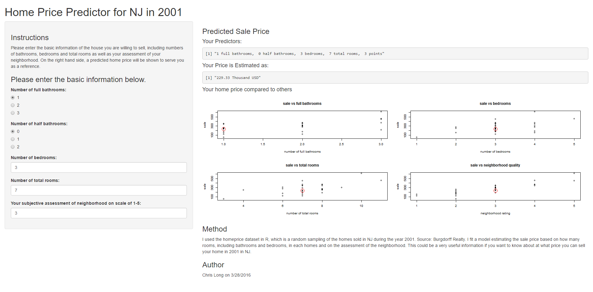

## How much can you sell your home in 2001

This topic may be of interest to some people who are concerned about the rising price over the last decades. Features that would influence the housing price:

- Number of Bedrooms, Bathrooms (the area of your home)
- the quality of your neighborhood
- Environment

--- .class1 #id

## The R Dataset

The homeprice Dataset is quite useful for this topic. It has the room data and neighborhood data with which we can do regression analysis.


```r
data("homeprice")
head(homeprice)
```

```
##    list  sale full half bedrooms rooms neighborhood
## 1  80.0 117.7    1    0        3     6            1
## 2 151.4 151.0    1    0        4     7            1
## 3 310.0 300.0    2    1        4     9            3
## 4 295.0 275.0    2    1        4     8            3
## 5 339.0 340.0    2    0        3     7            4
## 6 337.5 337.5    1    1        4     8            3
```

---

## Regression Model

Fit a linear model to estimate sale price against other variables excluding list price.

```r
lmModel = lm(sale ~ full + half + bedrooms + rooms + neighborhood, data = homeprice)
summary(lmModel)$coefficients
```

```
##                 Estimate Std. Error    t value     Pr(>|t|)
## (Intercept)  -135.262817   37.28315 -3.6279879 1.409919e-03
## full           26.225141   13.89585  1.8872648 7.180881e-02
## half           43.242340   12.83009  3.3703838 2.641273e-03
## bedrooms       20.409119   17.79774  1.1467255 2.632851e-01
## rooms           6.487697   10.38302  0.6248372 5.382280e-01
## neighborhood   77.242767   10.07700  7.6652562 8.859380e-08
```

```r
summary(lmModel)$r.squared
```

```
## [1] 0.907884
```

---  fill

## Predict the Housing Price

Prediction with an interactive Shiny App:


